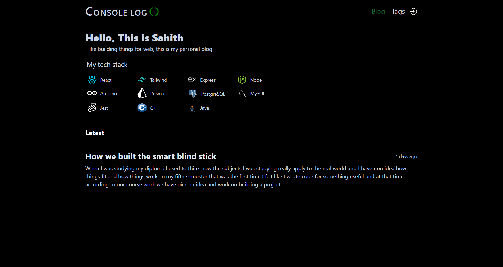
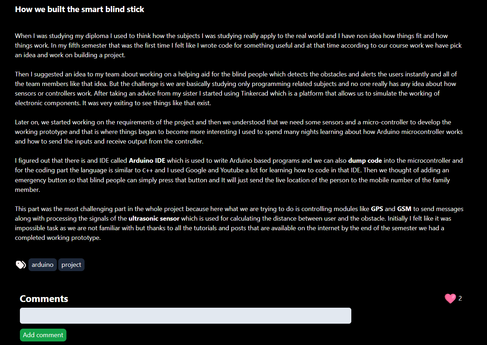
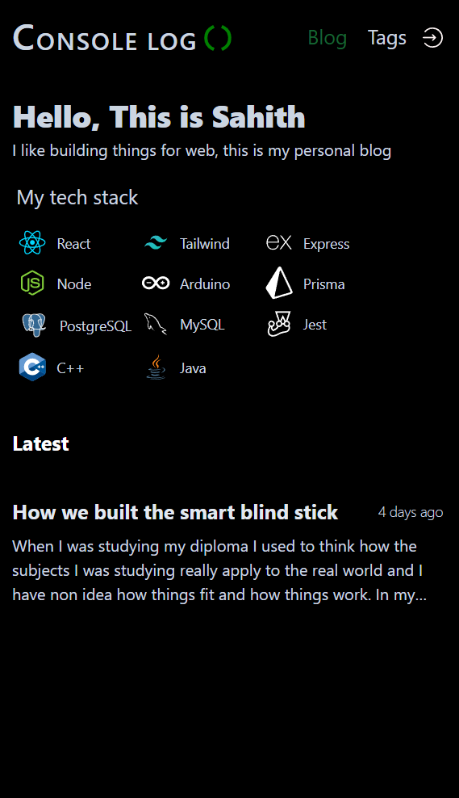
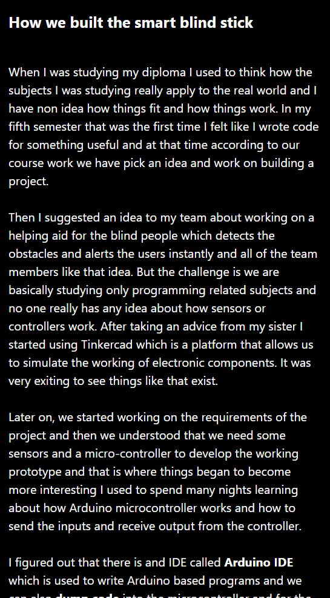
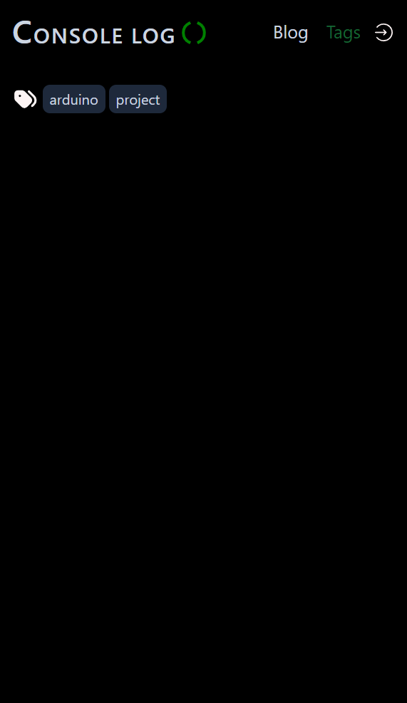

# Console log Blog

A blog client built with react and tailwind that fetches data from the a self-coded RESTful blog built with Express.js.

## Live:

[console-log-blog](https://console-log-blog.vercel.app/)

## Features

- Commenting on each post
- Filter posts by tags
- Like posts
- Tags section to view all the tags

## API

The blog client fetches the data from a self-coded blog API. The code for API can be found at: [API](https://github.com/SaiSahithPolimera/console-log-api)

## Content Management System

The blog can be managed from a self-coded content management system. The code for CMS can be found at: [Admin](https://github.com/SaiSahithPolimera/console-log-admin)

## Technologies used

- React JS
- Tailwind CSS
- date-fns
- dompurify
- html-react-parser
- react-hot-toast

## Screenshots

### Desktop

### Mobile

